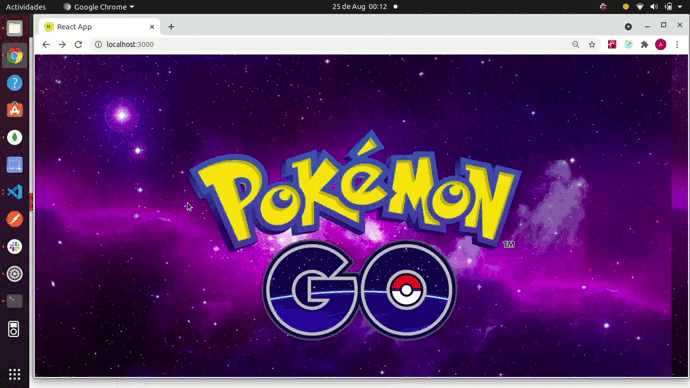
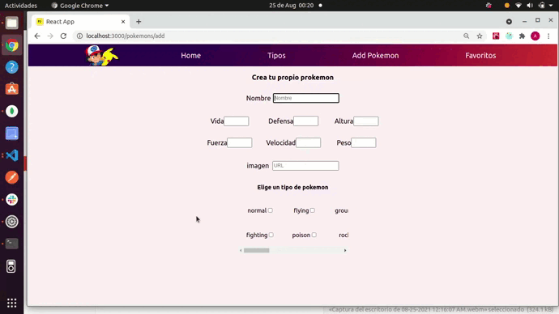
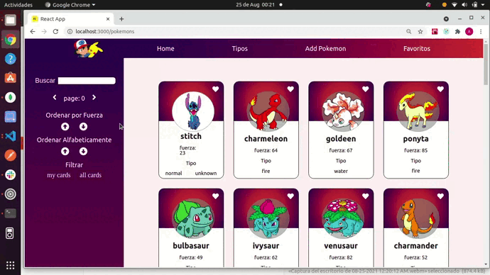
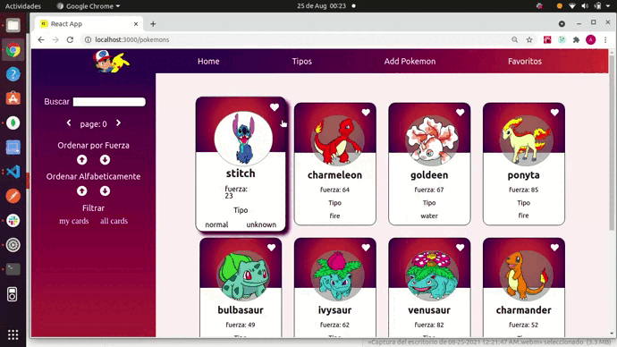
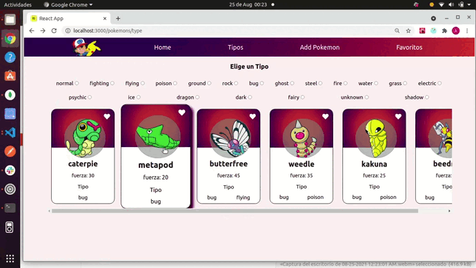
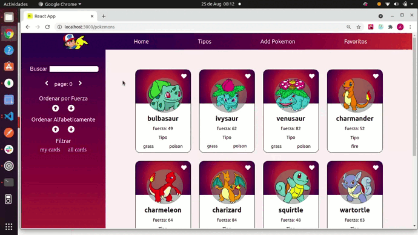

# PokeApp

 Esta es mi primera aplicacion Full Stack, esta realizada consumiento datos de la API 'pokeapi' para llenar la base de datos, en ella pcontras con 40 pokemons como base pero podes buscar mas, crear pokemons propios, adicionar a favoritos y contas con distintos tipos de filtrado
 
 

### CLONAR REPOSITORIO

* #### $ git clone https://github.com/andreajhl/PokemonApp.git
 
 

### PROBAR

### Después de clonar este repositorio.

* Ingresar a la carpeta del proyecto desde tu editor de codigo favorito.
* Abre la consola del proyecto
* En la terminal del proyecto ejecute la línea de comando, 'npm install'
* Al culminar la instalacion ejecute 'npm start' para arrancar el proyecto.
 
 

### TECNOLOGIAS USADAS

* #### HTML5
* #### SASS
* #### Javascript
* #### ReactJS
* #### Redux
* #### ExpressJS
* #### NodeJs
* #### Sequelize
* #### PostgreSQL

 
 

### PANTALLAS DEL PROYECTO Y USOS

* ### Home
 

 Al iniciar la app, encontraras una pagina de bienvenida, al dar click en la pokebola vas a ingresar al home, alli encontraras la barra de navegacion que posee cuatro items, tenes una barra lateral, la cual tiene opciones de ordenado, un input de busqueda y un paginado, realizado desde el front, que te muestra 12 pokemons por pagina
  

 

* ### Creacion de Pokemons
 

 A traves de un formulario controlado, vas a poder crear tu propio pokemon, este se guardara en la base de datos asi siempre que ingreses a la pag se mantedran los cambios,  
 

 
 

* ### Busqueda y Ordenamiento
 

En la barra lateral vas a encontrar los botones para ordenar de manera ascendente o descendente ya sea por fuerza o alfabeticamente, tambien podes filtrar y ver solo tus creaciones o todos los pokemon
 
Constas con un input de busqueda, la aplicacion trae de base 40 pokemons, sin embargo, la base de datos cuenta con mas de 200 pokemons los cuales podes buscar por sus nombres y se adiccionaran a tu home, si buscas algun pokemon que ya esta en el home, no se repetiran las tarjetas solo se cambiara de posicion
 

 
 

* ### Tipos
 

En esta sección vas a encontrar un listado de los 20 tipos o generos de pokemons con los que cuenta la base de datos y podes buscar desde alli a los pokemons de cada clase
 

 
 

* ### Detalles
 

Si gustas ver mas detalles de algun pokemon, basta con dar click sobre la tarjeta y te redirige a una nueva oantalla con datos extras como peso, puntos de vida, entre otros del pokemon seleccionado
 

 
 

* ### Favoritos
 

Por ultimo tenes la seccion de favoritos, en ella podes guardar todos los pokemons que gustes al darle click al corazon que tiene cada tarjeta, si posteriormente quieres borrarlos basta con darles a la 'x'
 

